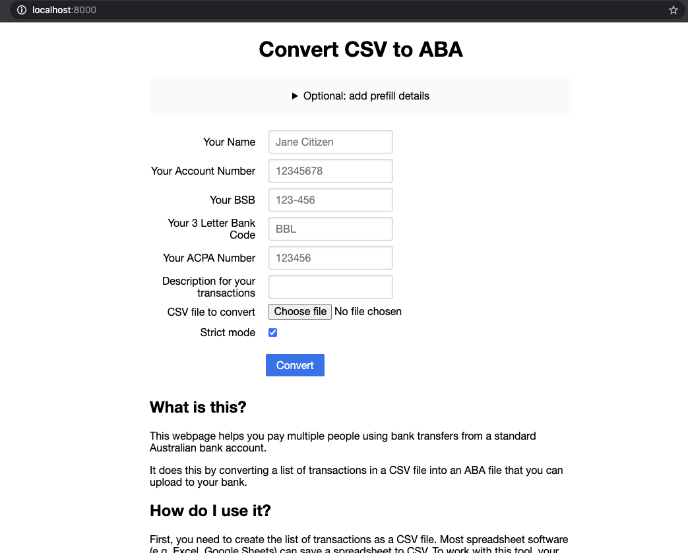

# CSV to ABA/Cemtex

This is a web-based tool for creating ABA/"Cemtex" files used by Australian banks for bulk payments.

You upload a CSV file in a simple format, and the website converts it to the ABA format.

This might be the right solution for you if you've ever asked any of the following questions:

* How do I make payments to multiple people at once?
* How do I automate payments for my business?
* How do I transfer money from a bank account using an API?

# Quickstart - Using Docker

Build it...

```
$ docker build -t aba .
```

Run it...

```
# run this if you're on macOS - your timezone will be set correctly
$ docker run --rm -ti -p 8000:8000 -e "TZ=$(readlink /etc/localtime | sed 's#/var/db/timezone/zoneinfo/##')" aba

# run this one if you're not (your time zone will be UTC, sorry)
$ docker run --rm -ti -p 8000:8000 aba
```

Open it...

Direct your browser to http://localhost:8000/




Done!


# CSV Format

1. Recipient BSB, formatted with a dash, e.g. 123-456
2. Recipient account number
3. Recipient name
4. Amount in cents to pay to this recipient
5. Transaction reference - some text that the recipient will see

```
123-456,12345678,Recipient Name,350,PAY OF THREE FIFTY
```

## License

Copyright Michael Sproul 2016.

Licensed under the terms of the GNU General Public License Version 3 or later (GPLv3+).

## Credits

ABA generation is done using [@jkal][jkal]'s [python-aba][] library.


[jkal]: https://github.com/jkal
[python-aba]: https://github.com/jkal/python-aba
